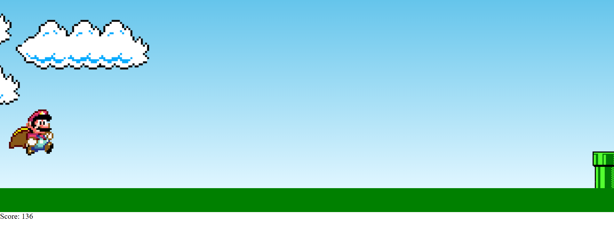

# Projeto de Estudo



## 📖 Descrição

Este é um projeto de estudo desenvolvido com HTML, CSS e JavaScript.

## 🗂️ Tabela de Conteúdos

- [Descrição](#descrição)
- [Instalação](#instalação)
- [Uso](#uso)
- [Funcionalidades](#funcionalidades)
- [Tecnologias Utilizadas](#tecnologias-utilizadas)

## 🚀 Instalação

1. Clone este repositório:

   ```bash
   git clone https://github.com/ClaytonEduard/supermario.git
   ```
2. Navegue até o diretório do projeto:
   ```bash
   cd supermario
   ```
3. Abra o arquivo index.html no seu navegador para visualizar o projeto.

# 📋Uso

    Ao abrir o arquivo index.html exibe meu game basico.

# 🌟Funcionalidades

- Pagina única: Um único botão permite iteração com o game
- Design responsivo: Interface ajustada para uma boa visualização em diferentes dispositivos.

# 🛠️Tecnologias Utilizadas

- HTML5: Estrutura da aplicação.
- CSS3: Estilização e layout.
- JavaScript: Lógica da aplicação

<h1>Obrigado!!!!!!</h1>